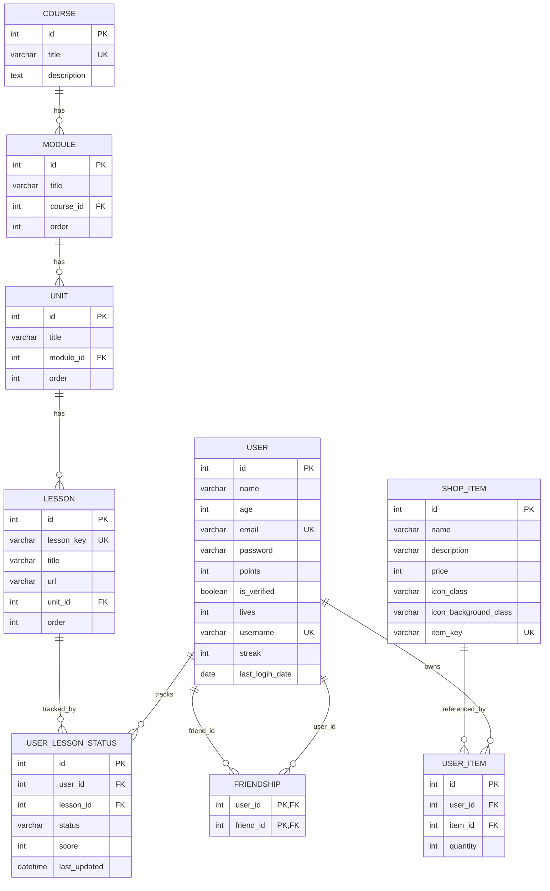

# Week 6 — Oracle MySQL DB Schema & ERD Analysis

## 목표
현재 Oracle Cloud MySQL HeatWave에 생성된 실제 DB 스키마와 기존 소스코드의 `models.py` 기준 스키마가 동일한지 비교하고, ERD 구조와 수정 필요 사항을 정리한다.

---

## 결론

초기 확인 시점의 Oracle MySQL DB 스키마는 **기존 소스코드의 `models.py`와 완전히 동일하지 않았다.**

발견된 핵심 차이:

```text
models.py에는 User.is_verified 컬럼이 존재하지만,
Oracle MySQL의 user 테이블에는 is_verified 컬럼이 없다.
```

이 때문에 `create_admin_user()` 실행 시 SQLAlchemy가 `user.is_verified`를 조회하려고 하면서 아래 오류가 발생했다.

```text
pymysql.err.OperationalError: (1054, "Unknown column 'user.is_verified' in 'field list'")
```

현재 조치:

```text
91b8f2d4c6a1_add_user_is_verified.py migration을 추가하고 DB에 적용 완료.
현재 Oracle MySQL의 user 테이블에는 is_verified 컬럼이 존재한다.
```

따라서 현재 기준으로는 **Flask source model이 요구하는 필수 컬럼은 Oracle MySQL에 반영된 상태**다.

---

## 현재 Oracle MySQL 상태

### 접속 대상

| 항목 | 값 |
|------|------|
| DB System | Oracle Cloud MySQL HeatWave |
| Local Tunnel Host | `127.0.0.1` |
| Local Tunnel Port | `3307` |
| Database | `signlingo` |
| Alembic Version | `91b8f2d4c6a1` |

### 생성된 테이블

```text
alembic_version
course
friendship
lesson
module
shop_item
unit
user
user_item
user_lesson_status
```

총 10개 테이블이 생성되어 있다.

---

## Source Schema 기준

기준 파일:

```text
models.py
```

정의된 모델:

| 모델 | 테이블 | 역할 |
|------|--------|------|
| `User` | `user` | 사용자 계정, 포인트, 생명, streak, 이메일 인증 상태 |
| `Course` | `course` | 수어 학습 코스 |
| `Module` | `module` | 코스 하위 모듈 |
| `Unit` | `unit` | 모듈 하위 유닛 |
| `Lesson` | `lesson` | 실제 학습 레슨 |
| `UserLessonStatus` | `user_lesson_status` | 유저별 레슨 진행 상태 |
| `ShopItem` | `shop_item` | 상점 아이템 정의 |
| `UserItem` | `user_item` | 유저별 보유 아이템 |
| `friendship` | `friendship` | 유저 간 친구 관계 association table |

---

## 실제 DB 스키마

### 1. `user`

| 컬럼 | DB 타입 | Nullable | Key | Source 존재 여부 |
|------|---------|----------|-----|------------------|
| `id` | `int` | NO | PK | 있음 |
| `name` | `varchar(80)` | NO |  | 있음 |
| `age` | `int` | YES |  | 있음 |
| `email` | `varchar(120)` | NO | UNIQUE | 있음 |
| `password` | `varchar(80)` | NO |  | 있음 |
| `points` | `int` | YES |  | 있음 |
| `lives` | `int` | YES |  | 있음 |
| `username` | `varchar(80)` | YES | UNIQUE | 있음 |
| `streak` | `int` | YES |  | 있음 |
| `last_login_date` | `date` | YES |  | 있음 |
| `is_verified` | `tinyint(1)` | YES |  | 있음 |

차이점:

- `is_verified` 컬럼은 migration 추가 후 DB에 반영됨
- `points`, `lives`, `streak`, `last_login_date`는 source default가 있지만 DB default는 없음
- `password`가 `varchar(80)`이라 향후 werkzeug password hash 저장에는 부족할 수 있음

---

### 2. `course`

| 컬럼 | DB 타입 | Nullable | Key | Source 존재 여부 |
|------|---------|----------|-----|------------------|
| `id` | `int` | NO | PK | 있음 |
| `title` | `varchar(100)` | NO | UNIQUE | 있음 |
| `description` | `text` | YES |  | 있음 |

상태:

- source와 구조 일치

---

### 3. `module`

| 컬럼 | DB 타입 | Nullable | Key | Source 존재 여부 |
|------|---------|----------|-----|------------------|
| `id` | `int` | NO | PK | 있음 |
| `title` | `varchar(100)` | NO |  | 있음 |
| `course_id` | `int` | NO | FK | 있음 |
| `order` | `int` | YES |  | 있음 |

차이점:

- source default `order=0`은 DB default로는 없음

---

### 4. `unit`

| 컬럼 | DB 타입 | Nullable | Key | Source 존재 여부 |
|------|---------|----------|-----|------------------|
| `id` | `int` | NO | PK | 있음 |
| `title` | `varchar(100)` | NO |  | 있음 |
| `module_id` | `int` | NO | FK | 있음 |
| `order` | `int` | YES |  | 있음 |

차이점:

- source default `order=0`은 DB default로는 없음

---

### 5. `lesson`

| 컬럼 | DB 타입 | Nullable | Key | Source 존재 여부 |
|------|---------|----------|-----|------------------|
| `id` | `int` | NO | PK | 있음 |
| `lesson_key` | `varchar(50)` | NO | UNIQUE | 있음 |
| `title` | `varchar(100)` | NO |  | 있음 |
| `url` | `varchar(200)` | YES |  | 있음 |
| `order` | `int` | YES |  | 있음 |
| `unit_id` | `int` | NO | FK | 있음 |

차이점:

- source default `order=0`은 DB default로는 없음

---

### 6. `user_lesson_status`

| 컬럼 | DB 타입 | Nullable | Key | Source 존재 여부 |
|------|---------|----------|-----|------------------|
| `id` | `int` | NO | PK | 있음 |
| `user_id` | `int` | NO | FK, UNIQUE 조합 | 있음 |
| `lesson_id` | `int` | NO | FK, UNIQUE 조합 | 있음 |
| `status` | `varchar(20)` | NO |  | 있음 |
| `score` | `int` | YES |  | 있음 |
| `last_updated` | `datetime` | YES |  | 있음 |

제약:

```text
UNIQUE(user_id, lesson_id) = _user_lesson_uc
```

차이점:

- source default `status='not_started'`는 DB default로는 없음
- source default/update `last_updated=datetime.utcnow`는 DB default로는 없음

---

### 7. `shop_item`

| 컬럼 | DB 타입 | Nullable | Key | Source 존재 여부 |
|------|---------|----------|-----|------------------|
| `id` | `int` | NO | PK | 있음 |
| `name` | `varchar(100)` | NO |  | 있음 |
| `description` | `varchar(255)` | NO |  | 있음 |
| `price` | `int` | NO |  | 있음 |
| `icon_class` | `varchar(50)` | NO |  | 있음 |
| `item_key` | `varchar(50)` | NO | UNIQUE | 있음 |
| `icon_background_class` | `varchar(50)` | NO |  | 있음 |

차이점:

- source default `icon_background_class='item-icon'`은 DB default로는 없음

---

### 8. `user_item`

| 컬럼 | DB 타입 | Nullable | Key | Source 존재 여부 |
|------|---------|----------|-----|------------------|
| `id` | `int` | NO | PK | 있음 |
| `user_id` | `int` | NO | FK | 있음 |
| `item_id` | `int` | NO | FK | 있음 |
| `quantity` | `int` | YES |  | 있음 |

차이점:

- source default `quantity=0`은 DB default로는 없음
- `(user_id, item_id)` unique 제약이 없어 같은 아이템 row가 중복될 수 있음

---

### 9. `friendship`

| 컬럼 | DB 타입 | Nullable | Key | Source 존재 여부 |
|------|---------|----------|-----|------------------|
| `user_id` | `int` | NO | PK, FK | 있음 |
| `friend_id` | `int` | NO | PK, FK | 있음 |

제약:

```text
PRIMARY KEY(user_id, friend_id)
```

상태:

- source와 구조 일치
- cascade delete는 설정되어 있지 않음

---

## ERD



---

## Relationship 분석

### Course → Module → Unit → Lesson

```text
course.id
  → module.course_id
    → unit.module_id
      → lesson.unit_id
```

의미:

- 하나의 Course는 여러 Module을 가짐
- 하나의 Module은 여러 Unit을 가짐
- 하나의 Unit은 여러 Lesson을 가짐

현재 문제:

- `lesson.unit_id`가 NOT NULL인데 초기 migration의 `lesson` 테이블 생성 시점에는 `unit_id`가 없고, 이후 migration에서 추가됨
- 새 DB migration에서는 정상 적용되었지만, 기존 데이터가 있는 DB에 적용할 때는 `unit_id` NOT NULL 추가가 실패할 수 있음

---

### User ↔ Lesson

```text
user.id
  → user_lesson_status.user_id

lesson.id
  → user_lesson_status.lesson_id
```

의미:

- 유저별 레슨 진행 상태 저장
- `(user_id, lesson_id)` unique 제약으로 한 유저가 같은 레슨 상태를 중복 저장하지 않도록 설계됨

현재 상태:

- unique 제약 `_user_lesson_uc` 존재
- 외래키 존재
- cascade delete 없음

---

### User ↔ User

```text
user.id
  → friendship.user_id
user.id
  → friendship.friend_id
```

의미:

- 유저 간 친구 관계
- `friendship` association table 사용
- composite primary key `(user_id, friend_id)`로 중복 관계 방지

현재 상태:

- 외래키 존재
- cascade delete 없음
- 코드에서는 `add_friend()` 호출 시 양방향 row를 모두 추가함

---

### User ↔ ShopItem

```text
user.id
  → user_item.user_id

shop_item.id
  → user_item.item_id
```

의미:

- 유저별 인벤토리 저장

현재 문제:

- `UserItem`에 `(user_id, item_id)` unique 제약이 없음
- 같은 유저가 같은 아이템을 여러 row로 가질 수 있음
- 상점 구매/사용 라우트 구현 시 중복 row 방지 로직 또는 unique 제약 추가 필요

---

## Source vs DB 차이 요약

| 항목 | Source (`models.py`) | Oracle MySQL DB | 영향 |
|------|----------------------|-----------------|------|
| `user.is_verified` | 있음 | 있음 | `91b8f2d4c6a1` migration으로 보정 완료 |
| Python-side defaults | 있음 | DB default 없음 | SQLAlchemy를 거치면 괜찮지만 raw SQL insert 시 null 가능 |
| `password` 길이 | `String(80)` | `varchar(80)` | password hash 적용 시 부족 가능 |
| cascade delete | relationship만 있음 | FK cascade 없음 | User 삭제 시 관련 row 때문에 실패 가능 |
| `user_item` unique | 없음 | 없음 | 같은 item 중복 row 가능 |

---

## 수정 및 개선 필요 사항

### 1. `user.is_verified` migration 추가

완료.

초기에는 source와 DB가 불일치해서 앱 코드가 정상 동작하지 않았다.

적용된 migration:

```python
with op.batch_alter_table('user', schema=None) as batch_op:
    batch_op.add_column(sa.Column('is_verified', sa.Boolean(), nullable=True))
```

결과:

- Alembic version: `91b8f2d4c6a1`
- Oracle MySQL `user.is_verified` 생성 완료
- admin user seed 성공

### 2. 시딩 방식 정리

현재 `init-app`은 `drop_all()`을 실행하므로 클라우드 DB에서 위험하다.

권장:

```bash
flask --app app.py db upgrade
```

이후 seed 함수만 따로 실행하는 CLI 명령을 추가하는 것이 좋다.

예:

```bash
flask --app app.py seed-data
```

seed 대상:

- lessons/course/module/unit
- admin user
- shop items

### 3. 비밀번호 해싱 대비

향후 werkzeug hash를 저장하려면:

```python
password = db.Column(db.String(255), nullable=False)
```

현재 `varchar(80)`은 부족할 수 있다.

### 4. cascade / delete 정책 검토

User 삭제 시 관련 테이블:

- `user_lesson_status`
- `user_item`
- `friendship`

현재 FK cascade가 없으므로 User 삭제 기능을 구현하거나 운영 중 삭제가 필요하면 cascade 설정 또는 수동 삭제 로직이 필요하다.

---

## 현재 적용 상태

### 이미 DB에 적용됨

- [x] 테이블 10개 생성
- [x] Alembic version `91b8f2d4c6a1`
- [x] FK/unique 대부분 생성
- [x] `signlingo` database 존재
- [x] `user.is_verified` 컬럼
- [x] seed data
  - course: 1
  - module: 1
  - unit: 1
  - lesson: 3
  - user: 1
  - shop_item: 4

### 아직 DB에 적용되지 않음

- [ ] Google SSO용 `google_id` 컬럼
- [ ] password hash용 password length 확장

---

## 다음 단계

1. Flask 앱 부팅 및 주요 기능 회귀 테스트
2. Week 6 문서와 `todo.md` 최신화
3. `feature/oracle-mysql-migration` 브랜치 push
4. Google SSO는 별도 브랜치에서 `google_id` migration으로 진행

---

*작성일: 2026-04-14*
*대상 DB: Oracle Cloud MySQL HeatWave `signlingo`*
