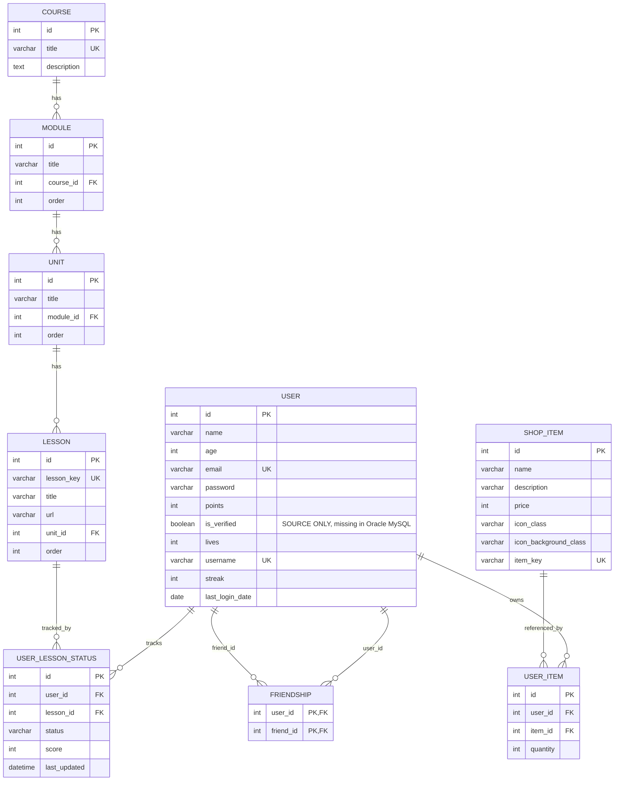

# SignLingo ERD Preview

## Oracle MySQL DB vs Source Model

## 확인된 불일치

| 항목 | Source | Oracle MySQL |
|------|--------|--------------|
| `user.is_verified` | 있음 | 없음 |
| `password` 길이 | `String(80)` | `varchar(80)` |
| Python-side defaults | 있음 | DB default 없음 |
| cascade delete | 코드 relationship만 있음 | FK cascade 없음 |
| `user_item` 중복 방지 | unique 없음 | unique 없음 |
